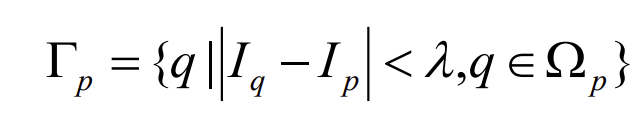

# 论文复现：窗口感知的高斯引导滤波
## 主要思路
输入任意待处理图像，首先对图像进行空间高斯滤波并生成滤波后的图像，表示为img_GS。同时对输入的图像做强度感知窗口分析，即对于每一个像素点周围的空间进行强度差异感知并且生成对应的强度感知窗口。基于img_GS以及图像强度感知窗口，根据文献中像素集感知的引导高斯颜色域滤波算法对图像进行处理，最终生成目标图像。

### 强度感知窗口

强度感知窗口Γ_p分析的具体步骤为基于中心像素点，计算周围像素点的差异值并且按照一定阈值定义强度窗口的该位置是否属于Γ_p，即：

其中λ为阈值，可定义为某比例系数k乘以255（像素最大值）以定义像素差异阈值。在实际中我们以0-1矩阵表示Ω_p的像素点是否属于Γ_p。

### 引导高斯滤波

根据强度窗口矩阵我们重构高斯滤波与归一化系数：

根据上式重新进行卷积操作即可完成引导高斯滤波GGF。

### 输入输出格式
在img文件夹内导入输入图片，运行程序，按如下文件名与后缀名格式输入（img.png输入格式)：

输出为图片名文件夹，内含普通高斯滤波GS、引导高斯滤波GGF、原图片以供参考：

### 参数设置
在如下位置修改值实现参数修改

### 结果展示
#### Case1
#### 原图

#### GS

#### GGF

#### Case2
#### 原图

#### GS

#### GGF

